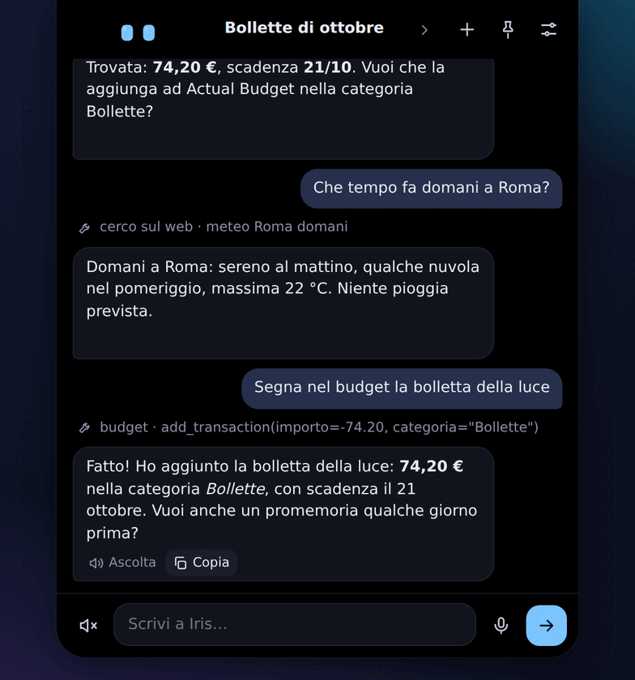
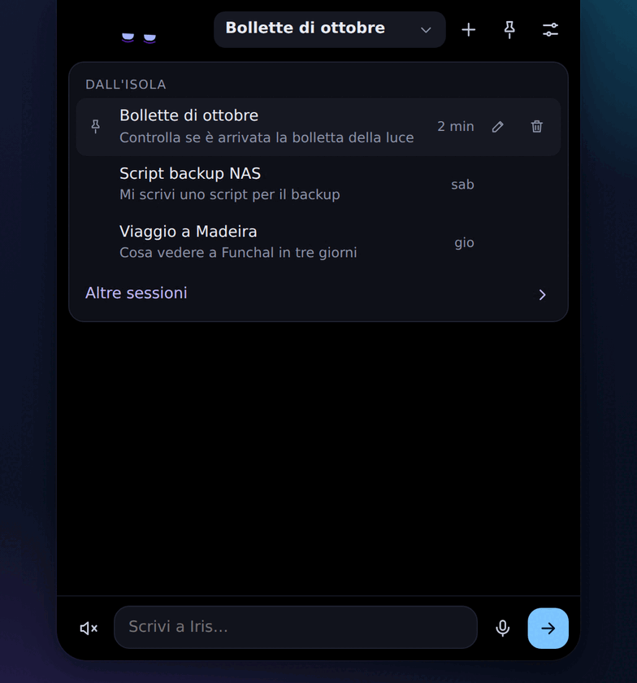
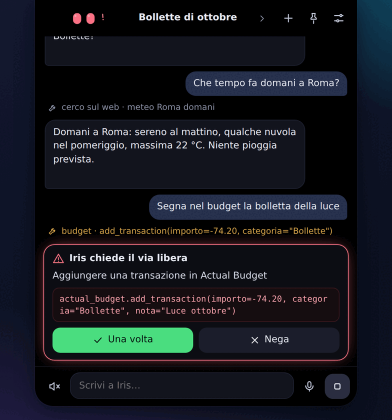
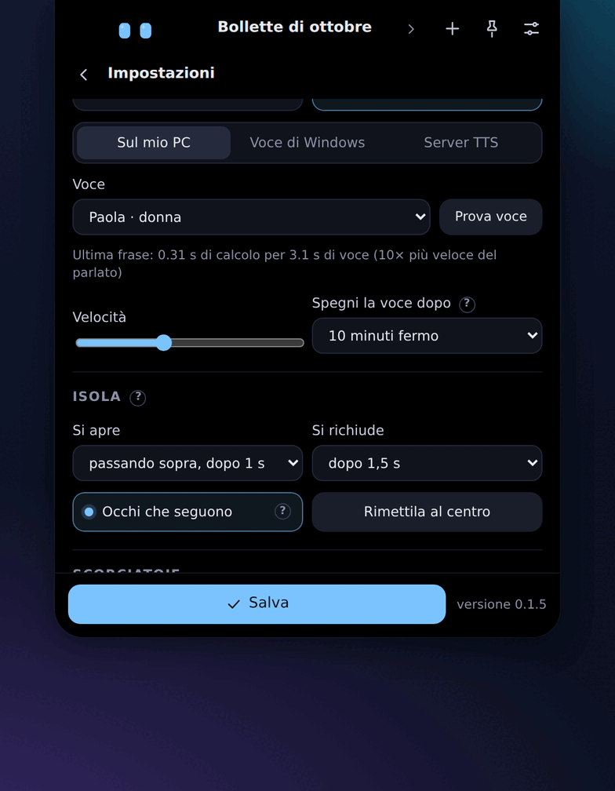
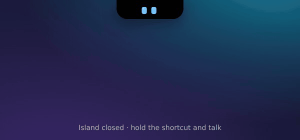
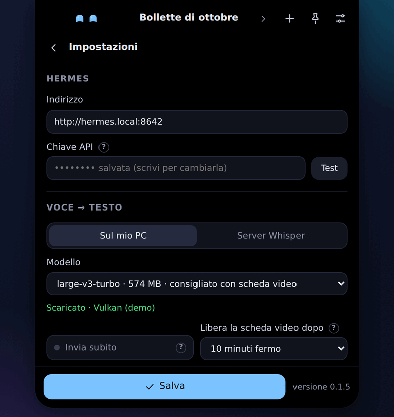
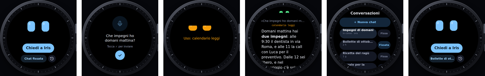

<div align="center">


# Iris Notch

**A face for your [Hermes agent](https://github.com/NousResearch/hermes-agent), living at the top of your Windows screen.**

Two animated eyes in a Dynamic-Island-style notch that show what your agent is doing.<br>
Hover to chat · hold a shortcut to talk · hear it answer out loud.

[**▶ Live demo**](https://mark9712seto.github.io/IrisNotch/demo.html) · [**Website**](https://mark9712seto.github.io/IrisNotch/) · [**Download for Windows**](../../releases/latest) · [All animations](https://mark9712seto.github.io/IrisNotch/animations.html) · [What's new](CHANGELOG.md)


<sub>Windows 10 / 11 · free for non-commercial use · no account, no telemetry · <a href="#italiano">italiano più sotto ↓</a></sub>

</div>

---

## What it does

<table>
<tr>
<td width="50%" valign="top">

### 💬 Hover it, and it opens into a chat
Replies stream in word by word, and you see the tools the agent is using as it uses them. Pin it to keep it open while you work, or drag it down to turn the notch into a floating bubble you can put anywhere, even on another monitor.

</td>
<td width="50%"></td>
</tr>
<tr>
<td></td>
<td valign="top">

### 🗂️ Every conversation, wherever it started
Chats started from the island come first. Everything else (Telegram, CLI, scheduled jobs…) is under **Other sessions**, with search, so you can pick it up right there. Rename and pin sessions; the names are saved on Hermes.

</td>
</tr>
<tr>
<td valign="top">

### 🛑 It asks before it acts
When the agent wants to run something that needs your permission, the eyes turn red and the exact command shows up. **Allow once** or **deny**. “Always” is left to Hermes' own interfaces, on purpose.

</td>
<td></td>
</tr>
<tr>
<td></td>
<td valign="top">

### 🎙️ Talk to it, hear it answer
- **Push to talk**: speech-to-text runs **on your PC** (whisper.cpp, GPU via Vulkan) or on your own Whisper server, with an editable preview before sending.
- **Spoken replies**: local voices with [Piper](https://github.com/rhasspy/piper) (English: Lessac, Ryan; Italian: Paola, Riccardo; about 85 MB, CPU only, no Python), Windows voices, or any OpenAI-compatible TTS server.
- Reading starts with the first sentence, while the reply is still being written. Volume and speed are adjustable.

</td>
</tr>
</table>

### 🤫 Compact voice: ask without opening anything


With the island closed, hold the shortcut and talk. The notch stretches just enough to show what it heard: **Enter** (or a tap of the shortcut) sends, **Esc** cancels, hold it again to redo. If the agent needs approval, it asks right there in the notch (**Enter** allows once, **Esc** denies, long commands scroll with the mouse wheel), and the reply shows up there too. Click the eyes to open the full chat. You can also skip the check: a short green bar, then it's sent.

### 👀 Live agent state

The eyes follow the real events of every Hermes run:

| | State | When |
|---|---|---|
| 🔵 | **Listening** | while you hold the push-to-talk shortcut |
| 🟣 | **Thinking** | the request reached the agent |
| 🟠 | **Using a tool** | mail, calendar, terminal, home… |
| 🟢 | **Answering** | while it writes, and while it speaks |
| 🔴 | **Needs approval** | it wants your OK |
| ✅ | **Done** | just finished |
| ⚫ | **Asleep** | Hermes can't be reached |

### ✨ Personality

It blinks, looks around and follows your mouse — sometimes eagerly, sometimes it couldn't care less. Leave the PC alone and it takes a nap; fling the mouse across the screen and it gets dizzy. Every 5 to 40 minutes, a surprise: **more than 150 small animations**, including Pong, Pac-Man, a DVD screensaver, holidays from around the world (Lunar New Year, Holi, Hanami, Star Wars Day, Diwali, Día de los Muertos, Thanksgiving…), greetings that change with the time of day, and confetti on your birthday.

**[See them all, live →](https://mark9712seto.github.io/IrisNotch/animations.html)**

### 🧩 Your own animations, no code

Put a `.json` file in `%APPDATA%\Iris Notch\animazioni`: key moments for the eyes (look, smile, wink…) and for a few shapes (heart, star, circle, rectangle, text). The app fills in the motion. It's a description only, so a file found online can move eyes and shapes and nothing else. The folder comes with a guide (`GUIDA.md`, every rule and measure) and an example ([source](app/src-tauri/animazioni/)).

```json
{
  "nome": "Saluto con il cuore",
  "durata": 5000,
  "occhi": [{ "t": 0 }, { "t": 0.2, "sorriso": 0.6, "dy": -8 }, { "t": 1, "sorriso": 0 }],
  "oggetti": [{ "forma": "cuore", "colore": "#fb7185",
                "chiavi": [{ "t": 0, "x": 80, "y": 110, "scala": 0 }, { "t": 0.3, "x": 80, "y": 50, "scala": 1 }] }],
  "quando": { "date": "02-14" }
}
```

## Try it in your browser

The [**live demo**](https://mark9712seto.github.io/IrisNotch/demo.html) runs the real interface against a pretend Hermes: open the island, ask for the weather, try an approval, open the settings, trigger an easter egg. Nothing is sent anywhere.

## Install

Full guide: [**docs/install.md**](docs/install.md) ([italiano](docs/installazione.md)). In short:

1. **Turn on Hermes' API server**: see [docs/hermes-setup.md](docs/hermes-setup.md) ([italiano](docs/hermes-setup.it.md)).
2. **Download the installer** from the [latest release](../../releases/latest) and run it. The app isn't code-signed yet, so Windows SmartScreen will warn you: **More info → Run anyway**.
3. On first start the settings open: enter the Hermes address (for example `http://your-hermes-host:8642`) and the API key, press **Test**, then **Save**.

Requirements: Windows 10/11 (WebView2 is already there on up-to-date systems) and Hermes Agent **0.21 or newer** (older versions answer every message as if it were the first one, without the earlier conversation). A GPU makes local speech-to-text faster; the local voice runs on any CPU. The app is in **English and Italian** (Settings → General → Language), with local voices in both languages.

<details>
<summary><b>Settings at a glance</b></summary>
<br>


Nothing changes until you press **Save**; while there are unsaved changes a small **Annulla** (cancel) appears and the island stays open. Also there: open on hover or on click, delays, eyes following the mouse, app size (small / normal / large), shortcuts, start with Windows, your birthday, debug log.
</details>

## Privacy and security

- **No account, no telemetry, no ads.** Iris Notch has no servers of its own; your conversations go only to the Hermes server you choose.
- **Keys** (Hermes, Whisper server, TTS server) live in the **Windows Credential Manager**, never in a file, and never go back to the interface.
- **Your voice** is transcribed on your PC or on your own server. The local voice works offline.
- **Downloads** (speech model, local voice) happen only after you confirm. The update check only reads the latest release number from GitHub; nothing is installed automatically.
- From the island you can only approve **once** or **deny**.

Full details in [PRIVACY.md](PRIVACY.md). To report a vulnerability, see [SECURITY.md](SECURITY.md).

## Also: Iris Dial ⌚



The same eyes on your wrist. [**Iris Dial**](https://mark9712seto.github.io/IrisDial/) ([GitHub](https://github.com/Mark9712Seto/IrisDial)) is a companion app for the Amazfit Balance 2 (Zepp OS): dictate a question, watch the eyes think, read the reply, and continue the chat, through your phone, straight to your own Hermes.

## Build from source

```bash
cd app
npm ci
npx tauri dev      # live reload of the UI
npx tauri build    # Windows installer
```

On Windows you need Rust, the Visual Studio C++ build tools, Node 22, the Vulkan SDK and LLVM (for `LIBCLANG_PATH`). The GitHub Actions workflow in [`.github/workflows/build.yml`](.github/workflows/build.yml) shows the exact setup.

- `tools/mock_hermes.py` is a fake Hermes API server for development (key: `prova`).
- `tools/bundle_demo.py` packs `app/ui` into a single HTML demo that runs against an in-memory mock.
- The website lives in `site/` and is published by [`.github/workflows/pages.yml`](.github/workflows/pages.yml).

Contributions are welcome: see [CONTRIBUTING.md](CONTRIBUTING.md).

## Credits

Made by **Variety Project**. *Iris* is the name of the character (the two eyes); you can call your assistant whatever you like. Built on [Tauri](https://tauri.app), [whisper.cpp](https://github.com/ggml-org/whisper.cpp) and [Piper](https://github.com/rhasspy/piper); full list and licenses in [THIRD-PARTY.md](THIRD-PARTY.md). Inspired by [Coucou](https://github.com/Louis-CFM/coucou). Iris Notch is an independent project, not affiliated with Nous Research, the Piper project or Amazfit/Zepp.

## License

Free to **use, study, modify and share for any non-commercial purpose**, under the [PolyForm Noncommercial License 1.0.0](LICENSE). Forks and pull requests are welcome.

**Selling it, or using it in a paid product or service, is not allowed** without written permission from Variety Project. Because of this restriction, Iris Notch is *source-available*, not “open source” as defined by the OSI.

---

## Italiano

**Iris Notch** dà un volto al tuo [Hermes Agent](https://github.com/NousResearch/hermes-agent): due occhi animati in cima allo schermo di Windows che mostrano cosa sta facendo l'agente (ascolta, pensa, usa uno strumento, risponde, chiede il via libera, ha finito).

- **Si apre** passando sopra o con un clic, e diventa una chat. La tacca si stacca e diventa una bolla da mettere dove vuoi.
- **Ci parli** tenendo premuta una scorciatoia: la trascrizione avviene sul tuo PC (o su un tuo server).
- **Voce compatta**: a isola chiusa tieni premuta la scorciatoia e parla; la tacca si allunga, mostra cosa ha capito, e con Invio parte. Via libera e risposta arrivano lì, nella tacca, senza aprire niente.
- **Ti risponde a voce** con Paola o Riccardo, o in inglese con Lessac e Ryan (Piper, sul processore, circa 85 MB), con le voci di Windows o con un server TTS.
- **Riprendi** le sessioni nate altrove (Telegram, terminale…) e dai il **via libera** alle azioni, una volta o nega.
- **Ha carattere**: più di 150 animazioni a sorpresa, feste di tutto il mondo, saluti secondo l'ora, e puoi aggiungerne di tue con un file JSON.

[**Prova la demo**](https://mark9712seto.github.io/IrisNotch/demo.html) · [Sito](https://mark9712seto.github.io/IrisNotch/) · [Scarica](../../releases/latest) · [Guida all'installazione](docs/installazione.md) · [Accendere l'API server di Hermes](docs/hermes-setup.it.md)

**Privacy**: niente account, statistiche o pubblicità; le chiavi stanno nel Gestore credenziali di Windows; le conversazioni vanno solo al tuo server Hermes. Dettagli in [PRIVACY.md](PRIVACY.md).

**Licenza**: uso, modifiche e condivisione gratis per scopi **non commerciali** ([PolyForm Noncommercial 1.0.0](LICENSE)). Venderlo o usarlo in un prodotto a pagamento richiede il permesso scritto di Variety Project. Fork e proposte di modifica sono benvenuti.
